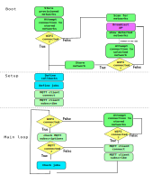

<meta name="google-site-verification" content="google9bfb406d215b1cc9.html">


##### - a basic MicroPython framework for microcontroller IoT projects!

[](https://bitbucket.org/Legarage/micropython_webserver/src/master/)
[](https://www.yr.no/sted/Norge/Tr%C3%B8ndelag/Trondheim/Bl%C3%A5klokkevegen/time_for_time.html)
[]()
[](https://github.com/micropython/micropython)
[](https://www.espressif.com/en/products/hardware/esp8266ex/overview)
[](https://www.espressif.com/en/products/hardware/esp32/overview)
[](https://github.com/aslake/mipy_esp/issues)
[](https://legarage.wordpress.com/)
[](https://en.wikipedia.org/wiki/Fan_club)


### Background

[MicroPython](http://docs.micropython.org/en/latest/) is a lean and efficient implementation of
the Python programming language that includes a small subset of the Python standard library
and is optimised to run on microcontrollers.

The [ESP8266](https://www.espressif.com/en/products/hardware/esp8266ex/overview) and
[ESP32](https://www.espressif.com/en/products/hardware/esp32/overview) are a low-cost Wi-Fi
microchips with full TCP/IP stack and microcontroller capability.


### The project

The **MiPy-ESP** code repository is a flexible framework for full-stack Python
IoT projects on the ESP-family microcontrollers.

The framework is developed by the **LeGarage Technical Comittee Software Developer Team**
([LG-TC-SWDT-01](https://legarage.wordpress.com/)) aiming at replacing already established 
C++ based code for our microcontroller applications.

The project provides basic features such as network connection procedures,
access point webserver, MQTT functionalities, logging/debugging, event scheduling,
hardware I/O and global configuration.

This software is gradually becoming the backbone of all our hobby electronics IoT projects
involving ESP-family microcontrollers. The main development and testing was done on esp8266 boards.
Preliminary testing indicate that the code runs on esp32 boards without any modifications.


### Repository structure

All Python framework modules are found in the /src folder.
The _/src/main.py_ and _/src/config.py_ files contain the application-specific code in the framework.
Upon chip boot, _main.py_ runs and imports all the project-dependency modules.
Examples of project-specific code can be found in the _/examples_ folder.

For code deployment, a [MicroPython cross compiler](https://github.com/micropython/micropython/tree/master/mpy-cross)
compiles the .py scripts to a binary container file format .mpy prior to chip upload.
The provided Makefile can be applied for compilation and transfers of all files from the /src folder to the /build folder
by the command:
```
make build
```
File generated in build/ are ready for transfer to microcontroller.
The command:
```
make clean
```
Deletes the build/ folder and its contents.

The repository folder structure below lists the current modules of the framework.
```
.
└── src                       # BASIC FRAMEWORK SOURCE CODE
    │  
    ├── boot.py
    ├── buttons.py            # Module for button interaction
    ├── config.py             # Global config file
    ├── crypt.py              # Encryption for stored SSID passwords
    ├── index.html            # Main page for wifi login
    ├── leds.py               # Module for led interaction
    ├── logfile.py            # Logging module
    ├── main.py               # Main code loop
    ├── microajax.js          # Lightweight Javascript AJAX
    ├── nanogram.min.css      # Lightweight CSS framework
    ├── scheduler_light.py    # Lightweight event scheduler
    ├── tm1637.py             # Module for TM1637 4 digit led display
    ├── umqttsimple.py        # MQTT module
    ├── utilities.py          # Various utility functions
    ├── webserver.py          # ESP access point webserver
    └── wifi.py               # Network connection module

.
└── build                     # PROJECT FRAMEWORK FOR CHIP UPLOAD [with .py modules compiled to .mpy]

.
└── examples                  # SPECIFIC PROJECT CODE FOR CHIP UPLOAD [to be added to /build]

```

### Framework architecture

The flowchart below describes the layout of the _main.py_ module:
Upon chip startup, the code attempts connection to wifi.
When a connection is established, callbacks and jobs are set up and
MQTT-client connects to a remote broker. The code then goes into a main loop, which
serves hardware I/O, job events, MQTT subscriptions
while maintaining chip network and MQTT broker connections.



The microcontroller code attempts connection with known networks upon chip boot.
All previously connected network SSIDs are stored together with their encrypted passwords
in chip flash memory. Networks and passwords can also be provisioned to the chip by uploading
_wifi.json_ in the format {"SSID1":"PASSWORD1", "SSID2":"PASSWORD2"} to the chip.
These networks are stored and passwords encrypted before the file is deleted from memory.
Note - information to decrypt the passwords is available on the chip, so at least with physical
access to the chip the stored wifi passwords should be considered compromised.

If no known networks are detected by the chip upon startup, an access point is broadcasted from the chip
 with a webserver for configuring wifi-settings. The access point and webserver shuts down upon
 successful connection of the chip to wifi.


### ESP access point webserver

The access point webserver module enables generic access point serving of files
uploaded to the chip.
Static .html files apply tailored CSS style for nice web interfaces;
The Nanogram CSS is a lightweight module based on the
[Milligram](https://milligram.io/) CSS framework.
Custom versions of minified Nanogram can be compiled from .sass source in the _/css_ folder.
Webpages apply Microajax, a lightweight javascript for asynchronous interaction
with backend files in chip flash memory and for smooth updating of webpages.
Below is an exampe screenshot of a webpage served from the MiPy-ESP chip webserver.


### Configuration
A project specific configuration file _config.py_ belongs to the _main.py_ script.
In the config file, global application parameters are set: level of debugging and
logger settings, access point name and password, MQTT client and broker settings,
device name and framework version (git commit id) applied amongst other.
It is generally reccommended to upload the _main.py_ and _config.py_ in readable
.py format to the chip, in order to enable inspection of the main code and its
configuration in case of software upgrade or debugging of deployed hardware.


### Getting started
Using [esptool.py](https://github.com/espressif/esptool) you can erase
the ESP flash memory with the command:

```
esptool.py --port /dev/ttyUSB0 erase_flash
```

Current project master branch of the repo has been tested and is operational with Micropython
v.1.12

Download file
'[esp8266-20191220-v1.12.bin](https://micropython.org/resources/firmware/esp8266-20191220-v1.12.bin)'
from [Micropython](https://micropython.org/) website and write to chip using :

```
esptool.py --port /dev/ttyUSB0 --baud 460800 write_flash --flash_size=detect 0 esp8266-20191220-v1.12.bin
```

Upload all files in /build directory to ESP chip using for example
[rshell](https://github.com/dhylands/rshell) - and the chip is ready
to launch...

A terminal window based workflow for developing applications could be:

* Develop application specific python modules as required
* In order to reduce memory usage consider compiling .py source code into .mpy bytecode
  using the [mpy-cross compiler](https://github.com/micropython/micropython).
  See the mipy_eps/Makefile.
* Use rshell to transfer files to the microcontroller and run the files on the chip:

```
rshell -p /dev/ttyUSB0
cp *.mpy /pyboard   # to easy transfer files to the microcontroller board
ls /pyboard         # to list files on the microcontroller board
repl                # to start the interactive interpreter mode and test code on the chip
```

### Ongoing developments
The project is work in progress. The software is provided "as is", without warranty of any kind.
No deadlines exist for the development, but plenty of IoT deployments are in the pipeline...

Complete repository [issue tracker](https://github.com/aslake/mipy_esp/issues)
can be found in the Github repository.


### Resources, credits and inspiration

- https://micropython.org/
- https://randomnerdtutorials.com/ : src/umqttsimple.py
- https://github.com/rguillon/schedule/ : inspiration for src/scheduler_light.py
- https://github.com/mcauser/micropython-tm1637 : src/tm1637.py


### Authors:

Aslak Einbu & Torbjørn Pettersen


### Contributing

All members and potential prospects of LeGarage Technical Committee are invited to contribute
to the MiPy-ESP project.
Contributors are encouraged to establish development branches and to
perform successful testing prior to submitting pull requests to master.
